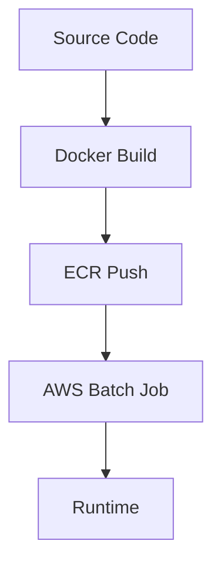

# Process Documentation

## 1. Development Process
### 1.1 Build Process

### 1.2 Deployment Process
1. Container image build
2. ECR push
3. AWS Batch job definition update
4. Job submission

## 2. Operational Procedures
### 2.1 Monitoring
- CloudWatch metrics
- GPU utilization
- Cost tracking
- Performance metrics

### 2.2 Maintenance
- Regular security updates
- Performance optimization
- Cost analysis
- Backup verification

## 3. Cost Management
- Monthly budget tracking
- Spot instance optimization
- Storage cost optimization
- Regular cost analysis reviews

This documentation provides a comprehensive overview of the LAMMPS AWS GPU project, covering requirements, technical design, architecture, and processes. The documentation should be reviewed and updated regularly as the system evolves.