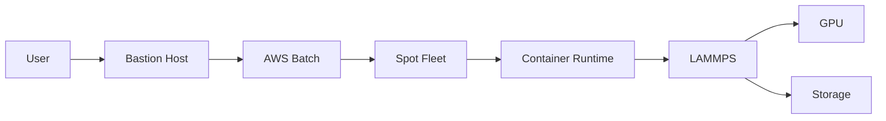

# System Architecture

## 1. High-Level Architecture

## 2. Component Details
### 2.1 Compute Layer
- Primary: p4d.24xlarge spot instances
- Failover: On-demand instances
- GPU: NVIDIA A100

### 2.2 Storage Layer
- S3 for persistent storage
- EBS for temporary storage
- Checkpoint management system

### 2.3 Network Layer
- VPC configuration
- Security groups
- Access control

## 3. Security Architecture
- IAM roles with least privilege
- VPC security groups
- Encryption at rest and in transit
- Bastion host access