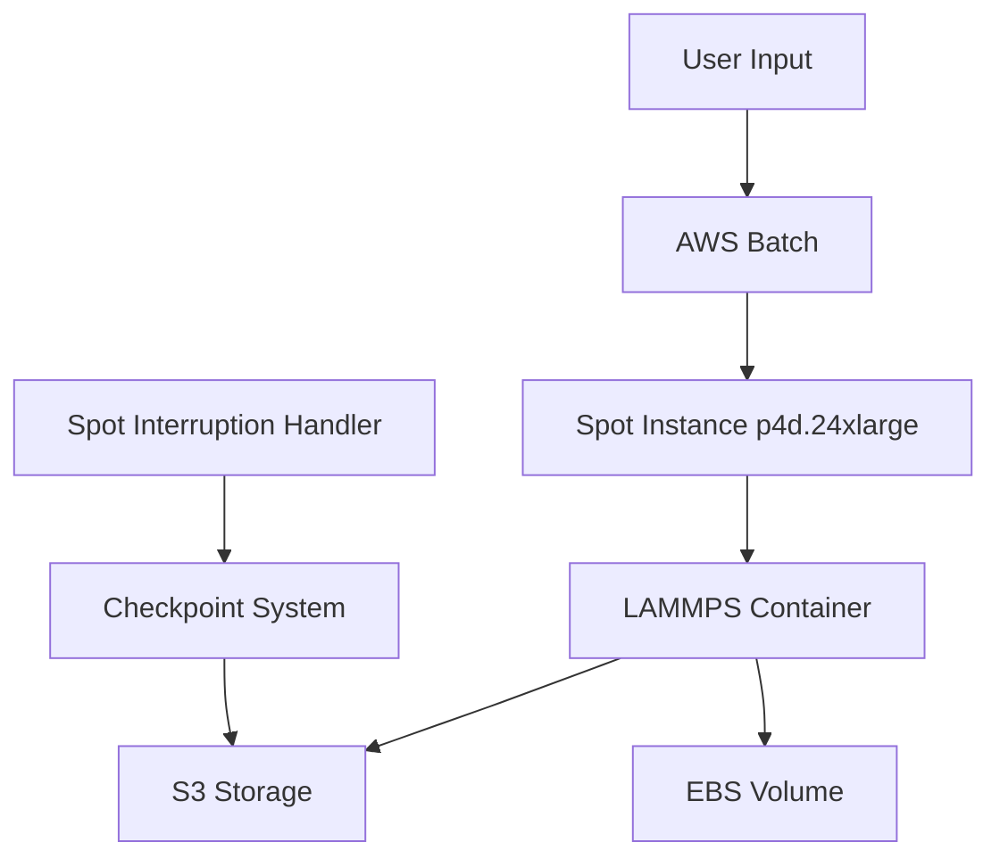

# Technical Design Document (TDD)

## 1. System Components

## 2. Container Architecture
- Base image: nvidia/cuda:12.0.1-devel-ubuntu22.04
- LAMMPS build with GPU acceleration
- Checkpoint management scripts
- Spot interruption handlers

## 3. Storage Architecture
- Primary: S3 bucket (10TB)
- Instance: 1TB gp3 EBS
- Checkpoint retention: Latest 3 versions

## 4. Infrastructure
### 4.1 AWS Services
- AWS Batch for job management
- ECR for container registry
- S3 for persistent storage
- VPC with private/public subnets

### 4.2 Networking
- VPC with public/private subnets
- S3 Gateway Endpoint
- Security groups for access control